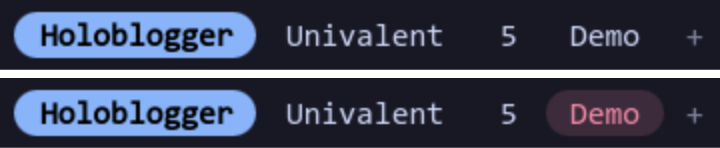
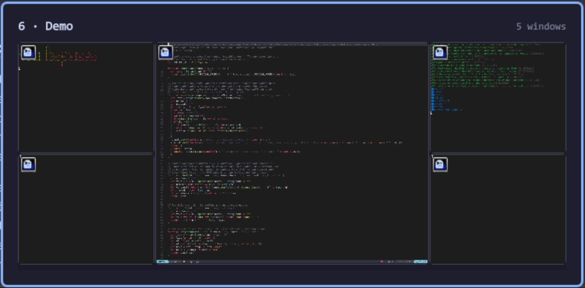
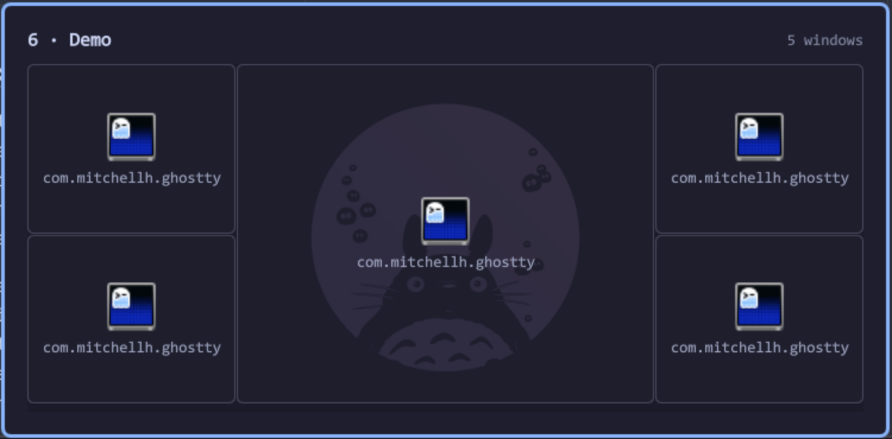

# Beautiful Workspace Bar

An [Omarchy](https://omarchy.org) bar widget that shows every Hyprland
workspace by the name Hyprland gives it. An accent pill slides to the focused
one, urgent workspaces pulse, and hovering shows a workspace's windows. You
can drag workspaces into a new order, rename one with a right-click, and add
one with **+**. It replaces Omarchy's built-in `omarchy.workspaces`.


## Features

- **Hyprland's own names.** Labels come from Hyprland
  (`hl.dsp.workspace.rename`), not from a list in the widget's settings. A
  workspace renamed from a script, a keybinding or the bar shows the new name
  at once. An unnamed workspace shows its number.
- **Every workspace,** in id order, created and removed as Hyprland creates
  and removes them. Hidden (special) workspaces such as the scratchpad come
  after a separator.
- **Survives renumbering.** Moving a workspace to a new id with
  `hl.dsp.workspace.change_id`, as a script that keeps workspaces numbered
  1, 2, 3… does, is followed correctly. The built-in widget loses track here
  (see [How it works](#how-it-works)).
- **A sliding pill** in the theme's accent marks the focused workspace.
- **Urgent workspaces pulse** in the theme's urgent colour until you visit
  them.
- **Hover previews** draw the workspace's windows where they really are, over
  your wallpaper, as screenshots or as app icons.
- **Drag to reorder**, **right-click to rename**, **+ for a new workspace**.
- **Follows the Omarchy theme**: colours, font, bar size and corner radius
  update live on `omarchy theme set`.
- **Vertical bars** get a column of numbers.
- **Everything can be turned off** (see [Settings](#settings)).



| Hover preview (`capture`) | Hover preview (`icons`) |
| --- | --- |
|  |  |


## Install

```sh
omarchy plugin add https://github.com/brandonpollack23/omarchy-beautiful-workspace-bar.git --enable
omarchy plugin disable omarchy.workspaces
```

`--enable` puts the widget at the end of the bar's left section. To move it
somewhere else, for example first:

```sh
omarchy bar move io.github.brandonpollack23.beautiful-workspace-bar --section left --index 0
```

Update it with `omarchy plugin update io.github.brandonpollack23.beautiful-workspace-bar`.

## Uninstall

```sh
omarchy plugin remove io.github.brandonpollack23.beautiful-workspace-bar
omarchy plugin enable omarchy.workspaces
```

## Controls

| On a workspace | Does |
| --- | --- |
| Left-click | Go to it. A hidden workspace is shown or hidden. |
| Right-click | Rename it, in Omarchy's input prompt. An empty name puts the number back. |
| Middle-click | Send the focused window there, staying where you are. |
| Drag | Move it along the bar. Workspaces are ordered by id, so this renumbers them. |
| Scroll | Previous / next workspace, wrapping round. |
| Hover | Preview its windows. |
| **+** | Open a new workspace after the last one. Hyprland drops it again if you leave it empty. |

## Settings

Set them in Omarchy's bar settings, or from a shell:

```sh
id=io.github.brandonpollack23.beautiful-workspace-bar
omarchy bar set $id previewMode icons
omarchy bar set $id previewSize 300 --json
omarchy bar set $id addButton false --json
```

| Key | Default | |
| --- | --- | --- |
| `showSpecial` | `true` | Show hidden (special) workspaces after a separator. |
| `showNumbers` | `false` | Show a named workspace as `1 Home` instead of `Home`. |
| `preview` | `true` | Hover previews. |
| `previewMode` | `"capture"` | `capture`: a screenshot of each window. `icons`: app icons only, never window contents. |
| `previewSize` | `220` | Height of the preview's screen in pixels (100–800). Its width follows the monitor's shape. |
| `addButton` | `true` | The **+** button. |
| `rename` | `true` | Right-click to rename. |
| `reorder` | `true` | Drag to reorder. |
| `renumberLua` | `""` | How reordering gives a workspace a new id. See below. |
| `middleClickMove` | `true` | Middle-click sends the focused window. |
| `scrollSwitch` | `true` | Scroll switches workspace. |
| `animate` | `true` | Slide the pill and pulse urgent workspaces. |

### Reordering and `renumberLua`

Hyprland orders workspaces by id, so dragging a workspace from last to second
place means giving it id 2 and moving the ones in between up. The widget
sends the whole move as one Lua chunk to `hyprctl eval`. Each workspace that
moves goes to a temporary id first, so no two workspaces ever share an id,
and any gaps in the numbering stay where they were.

Each id change runs `renumberLua`, with `{from}` and `{to}` filled in. Left
empty, it is Hyprland's own:

```lua
hl.dispatch(hl.dsp.workspace.change_id({ workspace = "{from}", id = {to} }))
```

If your config keeps something per workspace id, such as saved layouts,
point it at your own function so that moves with the workspace:

```sh
omarchy bar set io.github.brandonpollack23.beautiful-workspace-bar renumberLua \
  "require('hypr.workspaces').renumber({from}, {to})"
```

## Naming workspaces

Names are Hyprland's, so anything can set them. Besides right-clicking, a
keybinding in `~/.config/hypr/bindings.lua` can open the same prompt for the
focused workspace:

```lua
o.bind("SUPER + SHIFT + R", "Name workspace",
  "omarchy-shell io.github.brandonpollack23.beautiful-workspace-bar rename focused")
```

Or from a shell:

```sh
hyprctl eval "hl.dispatch(hl.dsp.workspace.rename({ workspace = '2', name = 'Web' }))"
```

## Keeping workspaces numbered (optional)

Hyprland leaves gaps: close workspace 2 of 1–4 and you have 1, 3, 4. The bar
shows whatever is there. If you'd rather keep workspaces numbered 1, 2, 3…
and insert new ones between others, a few lines of Hyprland Lua do it. This
is what I use: when a workspace opens or closes, the open ones are
renumbered in order.

```lua
-- ~/.config/hypr/workspaces.lua, loaded with require("hypr.workspaces")
local M = {}

-- Ids of the open workspaces, special ones left out, smallest first.
local function openIds()
  local ids = {}
  for _, workspace in ipairs(hl.get_workspaces()) do
    if not workspace.special and workspace.id > 0 then
      table.insert(ids, workspace.id)
    end
  end
  table.sort(ids)
  return ids
end

function M.renumber(from, to)
  hl.dispatch(hl.dsp.workspace.change_id({ workspace = tostring(from), id = to }))
end

-- Number the open workspaces 1, 2, 3... in the order they're in. Going up,
-- each one's new id is free: the ones below it have already moved under it.
local function compact()
  for index, id in ipairs(openIds()) do
    if id ~= index then
      M.renumber(id, index)
    end
  end
end

-- Deferred until Hyprland's list has caught up.
local function compactSoon()
  hl.timer(compact, { timeout = 20, type = "oneshot" })
end
hl.on("workspace.removed", compactSoon)
hl.on("workspace.created", compactSoon)

return M
```

My full setup also inserts a named workspace between two others, steps
through workspaces with keys (making a new one past the end), and keeps each
workspace's layout when it's renumbered:

- [`workspaces.lua`](https://github.com/brandonpollack23/rcfiles/blob/bb319a1/dotfiles/hypr/.config/hypr/workspaces.lua):
  compacting, `insert`, `step` and `renumber`
- [`layouts.lua`](https://github.com/brandonpollack23/rcfiles/blob/bb319a1/dotfiles/hypr/.config/hypr/layouts.lua):
  per-workspace layouts that follow a renumbering
- [`hypr-workspace-menu`](https://github.com/brandonpollack23/rcfiles/blob/bb319a1/dotfiles/hypr/.local/bin/hypr-workspace-menu):
  go / rename / move / new prompts in Omarchy's menu
- [`bindings.lua`](https://github.com/brandonpollack23/rcfiles/blob/bb319a1/dotfiles/hypr/.config/hypr/bindings.lua):
  the keys for them

With that setup, set `renumberLua` to
`require('hypr.workspaces').renumber({from}, {to})` so that dragging in the
bar goes through the same function.

## Scripting

The widget answers `omarchy-shell` IPC:

```sh
b=io.github.brandonpollack23.beautiful-workspace-bar
omarchy-shell $b preview 2     # open workspace 2's preview
omarchy-shell $b unpreview
omarchy-shell $b next          # or prev
omarchy-shell $b add           # new workspace at the end
omarchy-shell $b rename 2      # prompt for a new name ("focused" for the focused one)
omarchy-shell $b move 4 1      # move workspace 4 to the first position
omarchy-shell $b resync        # re-read Hyprland's state
```

## How it works

**Where the workspace list comes from.** Quickshell's Hyprland module (0.3.1)
keeps its own workspace objects, but it ignores Hyprland's
`changeworkspaceid` event, matches a newly created workspace by *name*, and
renames the first object with a given id. After a renumbering it can hold
stale and duplicate ids, which no refresh removes, and the bar drops a
workspace. So this widget reads Hyprland's own answer instead: `hyprctl -j
workspaces`, `monitors` and `clients`, once per burst of workspace or window
events. Focus comes straight from the `workspacev2` event, so the pill moves
without waiting. Urgency is tracked from the `urgent` event by window
address.

**Previews.** Windows are placed from `hyprctl clients` in logical pixels,
against the monitor's logical size (Hyprland reports monitors in physical
pixels). In `capture` mode each window is a single-frame `ScreencopyView` of
its Wayland toplevel, never a live feed. A window that doesn't deliver a
frame within 600 ms falls back to its app icon. At most 12 windows are drawn.

**Theme.** Everything binds to Omarchy's `Color` and `Style`. Text on the
pill is the theme's background or foreground, whichever has more contrast
with the accent, so light themes stay readable.

## Requirements

- Omarchy 4.x (its shell plugin system)
- Hyprland 0.56 or later, with the Lua config
- Quickshell 0.3.x (ships with Omarchy)
- A Nerd Font, for the hidden-workspace glyph (Omarchy's default font is one)

## Ideas

- App icons next to workspace names
- Only the workspaces on the bar's own monitor
- Dragging a window from the preview to another workspace

## Credits

Started from Omarchy's built-in workspaces widget (MIT). Thanks to
[wbuf81/omarchy-workspace-labels](https://github.com/wbuf81/omarchy-workspace-labels)
for notes on Quickshell's quirks: window captures, placeholder workspace
objects, and the physical/logical pixel mix.

## License

[MIT](LICENSE)
